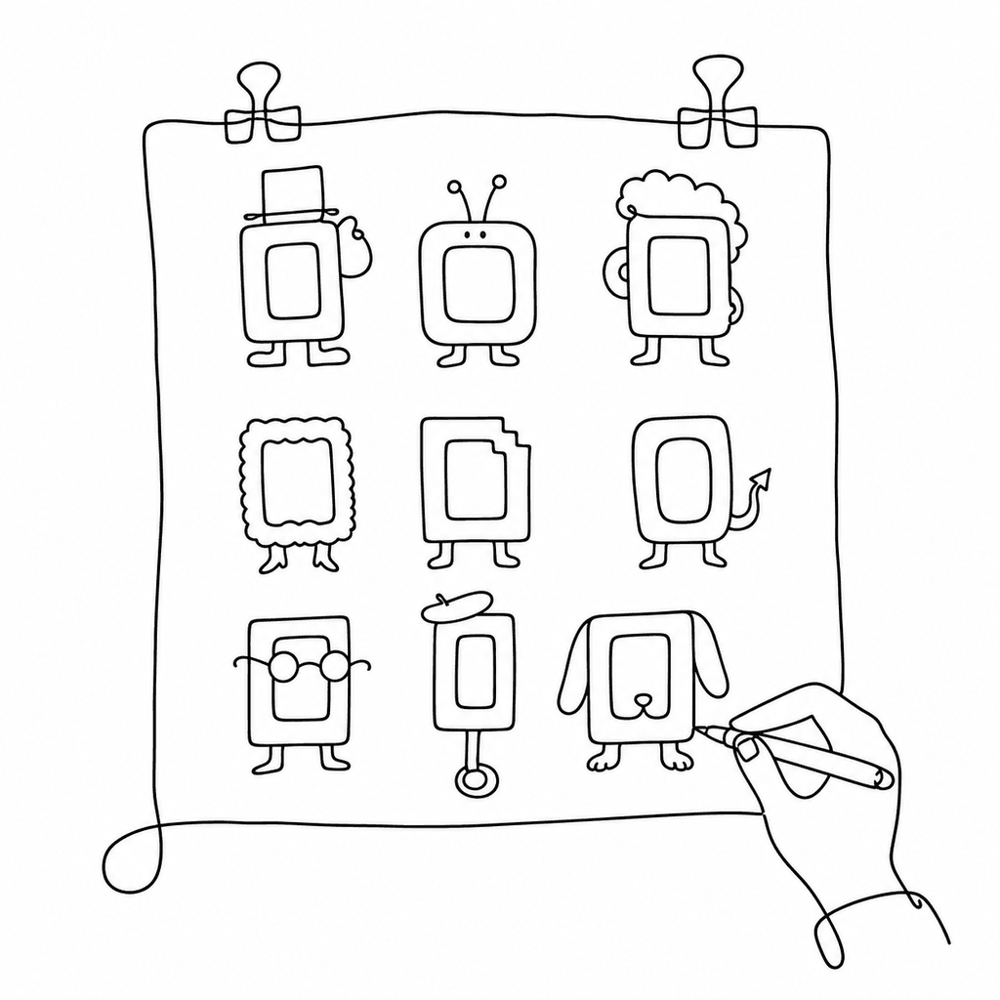

# Brex

A monospace typeface forked from IBM Plex Mono, kept as an open editable source you can build, tweak, and ship.



Brex starts where IBM Plex Mono stops: the same steady coding rhythm, the same 600-unit fixed advance, but with the drawing files opened up for modification. Where IBM ships finished binaries, Brex keeps the design sources — so a stubborn zero, a too-shy asterisk, or a missing ligature is a source edit away, not a wishlist item.

## Status

Work in progress. The repository holds the design sources; compiled `.ttf`/`.otf`/`.woff2` binaries ship on the [Releases](https://github.com/twardoch/brex-font/releases) page rather than in git history.

## What's inside

- **UFO sources** — IBM Plex Mono masters (Regular, Bold, Italic, Bold Italic), the starting point for the Brex drawing work.
- **Legacy FontLab files** — the original `BrexMono` VFJ/VFC studies from 2020 and a DeltaRig interpolation config, kept for reference.

Both live under the untracked `dev/` working directory to keep the repository lean. Binaries and heavyweight editor files stay out of git; the release artifacts carry the finished fonts.

## Build

Brex builds from the UFO masters with [fontmake](https://github.com/googlefonts/fontmake):

```bash
pip install fontmake
fontmake -u "dev/01-ufo/IBM Plex Mono-Regular.ufo" -o ttf --output-dir fonts/
```

Repeat per master, or point fontmake at a designspace once one is assembled. Validate the output with [fontbakery](https://github.com/fonttools/fontbakery):

```bash
pip install fontbakery
fontbakery check-universal fonts/*.ttf
```

## License

Brex is licensed under the [SIL Open Font License 1.1](OFL.txt), inherited from IBM Plex Mono. IBM Plex is a trademark of IBM Corp.; the Brex name and modifications belong to their respective authors. If you redistribute Brex, carry `OFL.txt` with it and do not sell the fonts on their own.

## Credits

- **IBM Plex Mono** — Mike Abbink and Bold Monday for IBM Corp.
- **Brex fork** — Adam Twardoch.